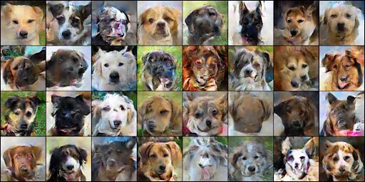
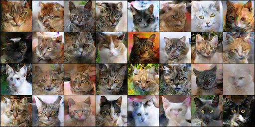
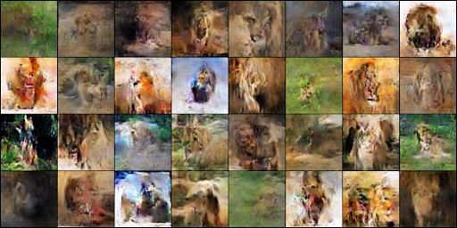
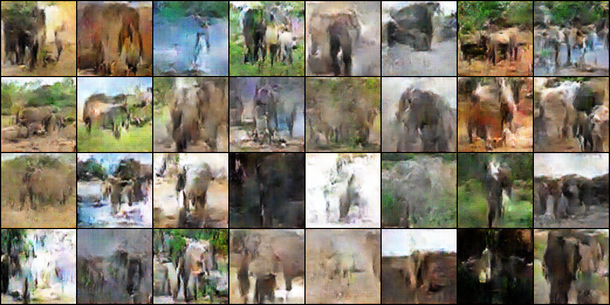
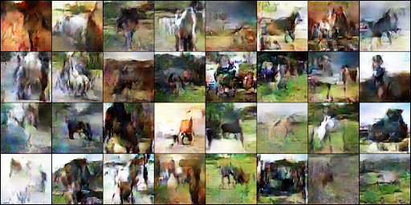
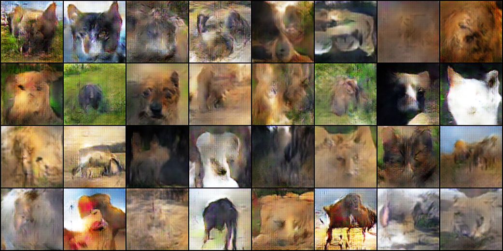

# dcgan-animal-generator

This project implements a Deep Convolutional Generative Adversarial Network (DCGAN) to generate synthetic animal images. The model was trained to learn the distribution of real animal photos and produce realistic generated samples through adversarial learning.

Originally developed as part of a deep learning course project. This repository contains my implementation and contributions.

---

## Project Overview

Generative Adversarial Networks (GANs) consist of two neural networks trained simultaneously:

- **Generator** – Produces synthetic images from random noise.
- **Discriminator** – Attempts to distinguish between real and generated images.

Through adversarial training, the generator improves by learning to "fool" the discriminator, resulting in increasingly realistic outputs.

This implementation follows the DCGAN architecture introduced in:

Radford et al., *Unsupervised Representation Learning with Deep Convolutional Generative Adversarial Networks*.

---

## Model Architecture

### Generator
- 100-dimensional latent noise vector
- Transposed convolutional layers
- Batch normalization
- ReLU activations
- Tanh output layer

### Discriminator
- Convolutional layers with stride (no pooling)
- Batch normalization
- LeakyReLU activations
- Sigmoid output layer

---

## Dataset & Data Pipeline

Dataset: Kaggle Animals Dataset  
https://www.kaggle.com/datasets/antobenedetti/animals  

- ~15,000 images across dogs, horses, cats, lions, and elephants  
- Initial experiments focused on generating dog images  

To reduce training time and improve stability:

- Images resized from 512×512 to 128×128  
- Converted to grayscale (3 channels → 1 channel)  
- Preprocessed images saved to structured folders  

---

## Training Details

- Optimizer: Adam  
- Learning Rate: 0.0002  
- Loss Function: Binary Cross Entropy (BCE)  
- Latent Dimension: 100  
- Image Size: 128×128  

GAN training is inherently unstable and prone to issues such as mode collapse. I experimented with preprocessing strategies and alternative loss functions (including Wasserstein loss) to improve convergence and output diversity.

---

## Generated Samples

After training:

---

## My Contributions

- Implemented DCGAN generator and discriminator architectures  
- Designed and implemented the adversarial training loop  
- Built the data preprocessing pipeline (resizing, grayscale conversion)  
- Tuned hyperparameters to improve training stability  
- Evaluated generated outputs and analyzed convergence behavior  

---

## Repository Structure

- `GAN_model.ipynb` – Model implementation and training  
- `images/` – Sample generated outputs  

---

## How to Run

Recommended Python version: 3.9+

1. Clone the repository:

git clone https://github.com/kaylaimbriale/dcgan-animal-generator.git

cd dcgan-animal-generator

2. (Recommended) Create a virtual environment:

python -m venv venv
source venv/bin/activate # Mac/Linux

3. Install dependencies:

pip install -r requirements.txt

4. Open `GAN_model.ipynb` and run all cells.
